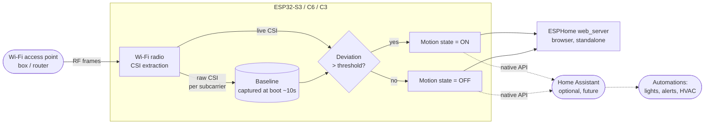

# Wi-Fi sensing — Data-flow diagram

UML data-flow of the ESPectre sensing pipeline, from radio waves to a consumable motion
state. Home Assistant is optional (dashed).

## Notes

- Moving bodies between the access point and the ESP32 perturb the RF path → CSI changes.
- The baseline is the "quiet room" fingerprint; a clean ~10 s calibration is required.
- The binary motion state is the only data produced — no images, no headcount.
- Standalone path (`web_server`) is enough to experiment; the Home Assistant path is an
  optional later addition for automations.
