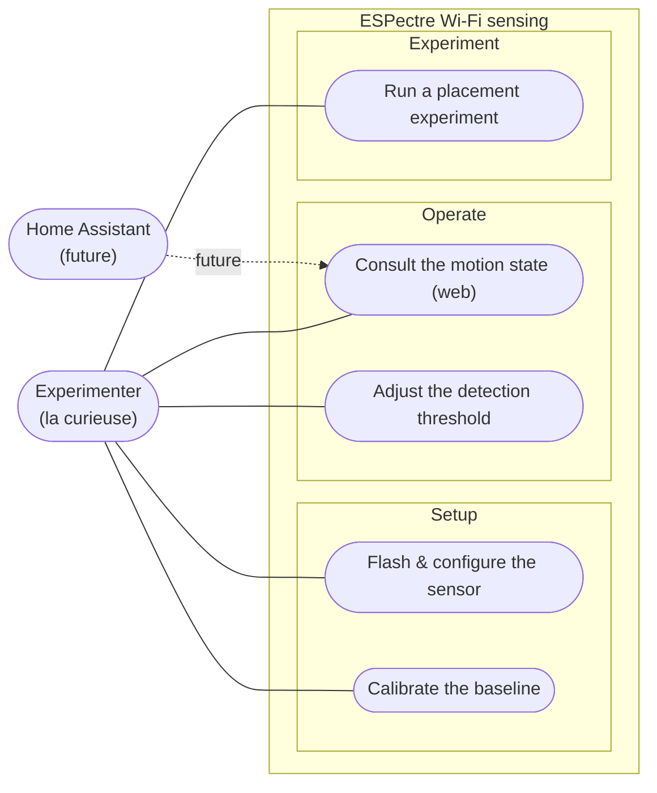

# Wi-Fi sensing — Use-case diagram

> **Frame:** `uc` — who interacts with the ESPectre sensing lab, and to do what.

UML use cases are **actor-initiated goals**, grouped by **domain** (Setup / Operate /
Experiment) — not by which component implements them. Home Assistant is a future,
optional secondary actor (dashed).

## Notes

- Every use case is a **verb + observable outcome** the Experimenter initiates —
  *"Calibrate the baseline"*, not *"Baseline is captured"* (that is a system event).
- Grouping is by **domain**, never by backend: there is deliberately no Mobile / API /
  Backend split here — that structural view lives in
  [03-component.md](03-component.md), not in a use-case diagram.
- *"Consult the motion state"* is a **pull** (the Experimenter opens the web server),
  not *"Be notified of motion"* (a passive trigger, which is not a use case).
- Home Assistant is dashed: a later integration would let it consult the state for
  automations, but it is out of the current standalone scope.
