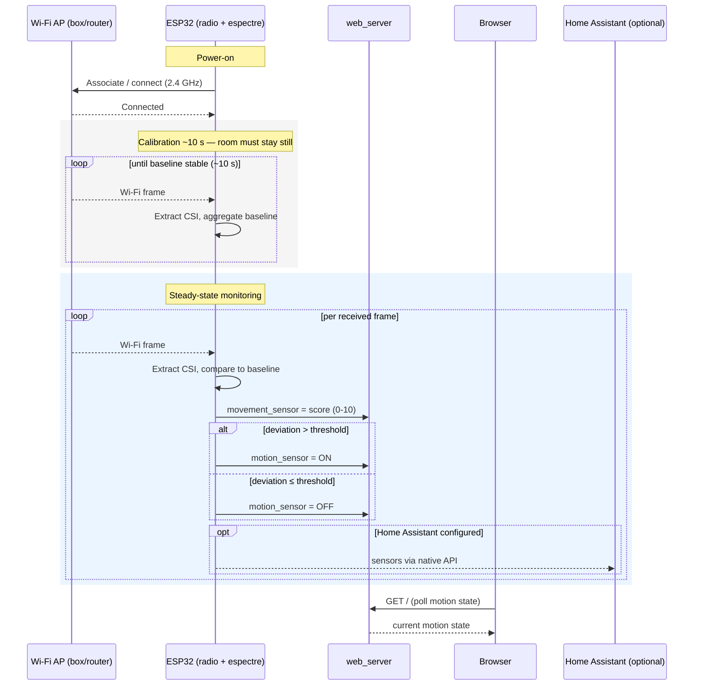

# Wi-Fi sensing — Sequence diagram (detection scenario)

> **Frame:** `sd` — what happens *in time* from power-on to a consumable motion state.

The critical runtime scenario: boot, the ~10 s calibration window, then the steady-state
detection loop. This is the **per-frame loop** that the structural data-flow view
([06-data-flow.md](06-data-flow.md)) cannot show in time.

## Notes

- A bad calibration (movement during the first ~10 s) poisons the baseline for the whole
  session — the only recovery is a reboot (see [05-state-motion.md](05-state-motion.md)).
- Two outputs are published each frame: the binary `motion_sensor` (ON/OFF) **and** the
  `movement_sensor` 0-10 score. Neither is a headcount or identity, consistent with
  [how-it-works.md](../../../how-it-works.md).
- The Home Assistant leg is an `opt` block: nothing is sent unless the native API is
  actually wired to an HA instance (future).
