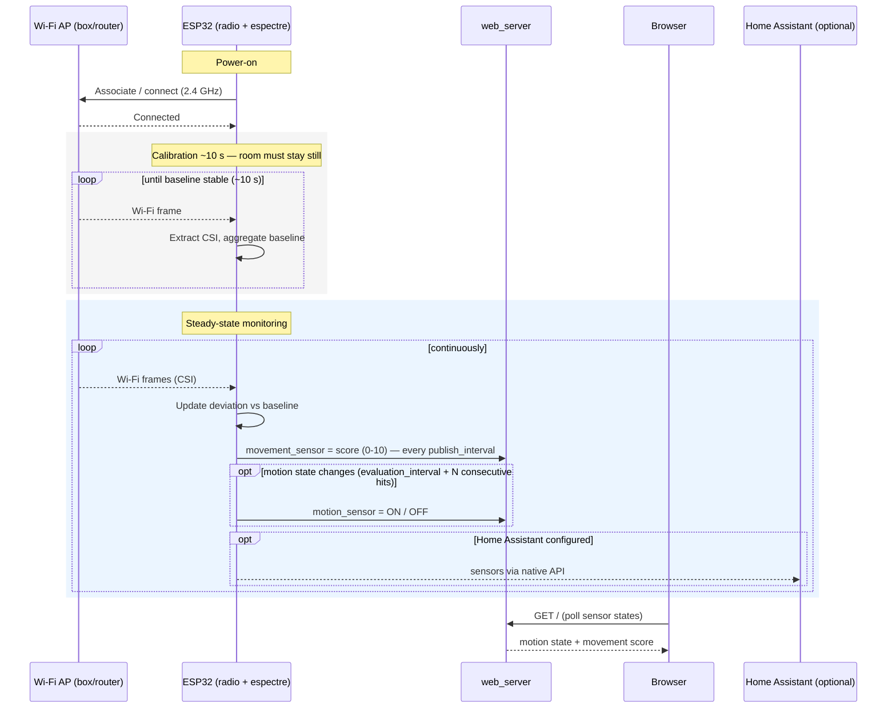

# Wi-Fi sensing — Sequence diagram (detection scenario)

> **Frame:** `sd` — what happens *in time* from power-on to a consumable motion state.

The critical runtime scenario: boot, the ~10 s calibration window, then the steady-state
detection loop. This is the runtime view that the structural data-flow
([06-data-flow.md](06-data-flow.md)) cannot show in time — including the two outputs'
distinct cadences.

## Notes

- A bad calibration (movement during the first ~10 s) poisons the baseline — recover by
  toggling the `calibrate` switch (runtime recalibration) or rebooting (see
  [05-state-motion.md](05-state-motion.md)).
- The two outputs have **different cadences**: the `movement_sensor` 0-10 score publishes
  every `publish_interval`, while the binary `motion_sensor` flips on `evaluation_interval`
  after N consecutive hits (`motion_on_hits` / `motion_off_hits`, anti-flicker). Neither is
  a headcount or identity, consistent with [how-it-works.md](../../../how-it-works.md).
- The Home Assistant leg is an `opt` block: nothing is sent unless the native API is
  actually wired to an HA instance (future).
