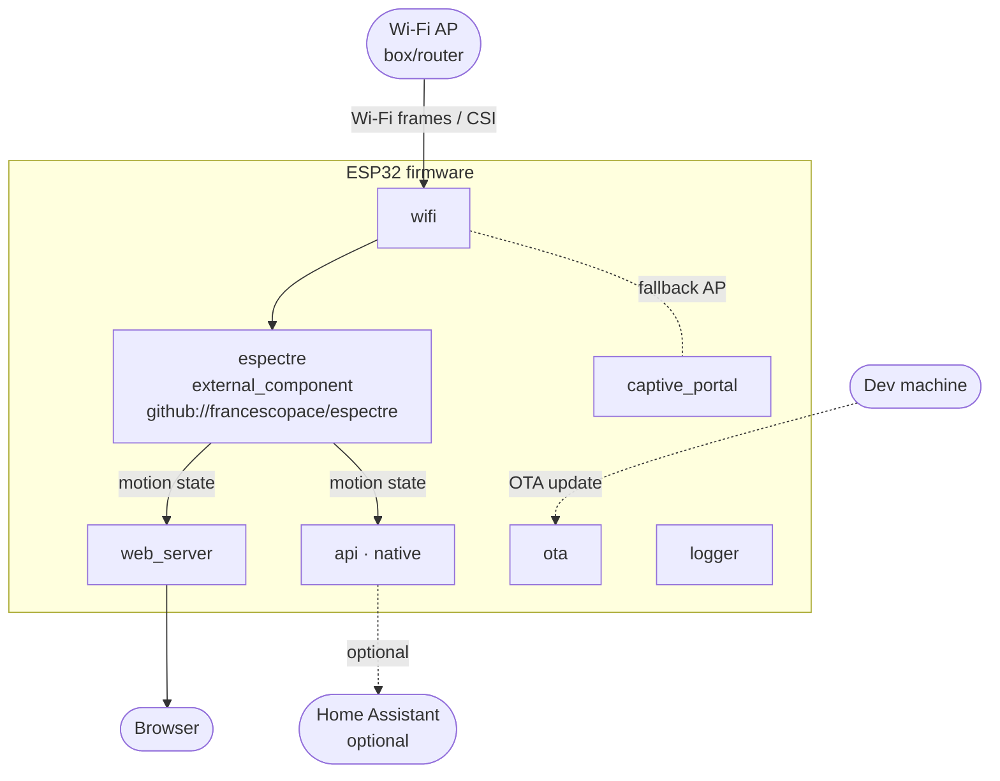

# Wi-Fi sensing — Component diagram

> **Frame:** `cmp` — the structural boundaries and dependencies of the firmware.

The whole product is a single ESP32 firmware built by ESPHome. `espectre` is pulled in as
an **external component** from GitHub and baked into the image; the other blocks are
standard ESPHome components configured in [espectre.yaml](../../../../esphome/espectre.yaml).

## Notes

- The **only egress points** for the motion state are `web_server` (browser, used now)
  and `api` (Home Assistant, future) — there is no cloud path, by design.
- `espectre` depends on `wifi` for the raw CSI stream; everything downstream consumes the
  binary state `espectre` produces.
- `captive_portal` is the fallback when the configured Wi-Fi is unreachable; `logger`
  is cross-cutting (serial/web logs) and has no functional dependency.
- This is a structural view only — *who wants what* lives in
  [01-use-case.md](01-use-case.md), not here.
