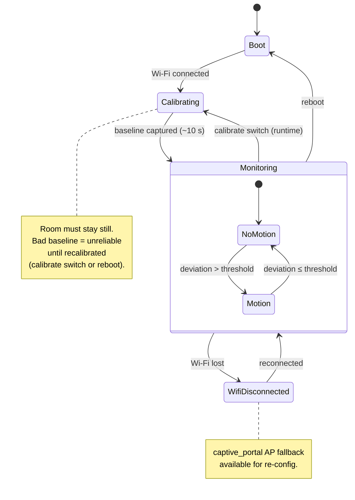

# Wi-Fi sensing — State diagram (motion lifecycle)

> **Frame:** `stm` — the lifecycle the device goes through, from boot to motion reporting.

ESPectre's behaviour is essentially a state machine: a one-shot calibration, then a
two-state monitoring loop driven by the deviation-vs-threshold test.

## Notes

- `Monitoring` is the only steady state; `NoMotion` ↔ `Motion` is the binary output
  surfaced to `web_server` — no intermediate "maybe" / count states by design.
- The baseline is captured at `Calibrating`; recapture it at runtime with the `calibrate`
  switch (no reboot needed) — or by rebooting — after moving the board or rearranging
  furniture (see [setup-esphome.md](../../../setup-esphome.md) §Tuning).
- A Wi-Fi drop does **not** re-trigger calibration: on reconnect the device resumes
  `Monitoring` with the existing baseline.
