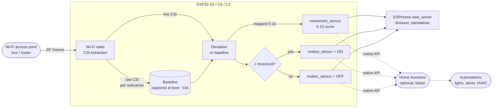

# Wi-Fi sensing — Data-flow diagram

UML data-flow of the ESPectre sensing pipeline, from radio waves to the two consumable
outputs (binary motion + 0-10 movement score). Home Assistant is optional (dashed).

## Notes

- Moving bodies between the access point and the ESP32 perturb the RF path → CSI changes.
- The baseline is the "quiet room" fingerprint; a clean ~10 s calibration is required.
- Two outputs are produced: a binary `motion_sensor` and a 0-10 `movement_sensor` score
  (the deviation magnitude mapped to 0-10) — no images, no headcount.
- Standalone path (`web_server`) is enough to experiment; the Home Assistant path is an
  optional later addition for automations.
